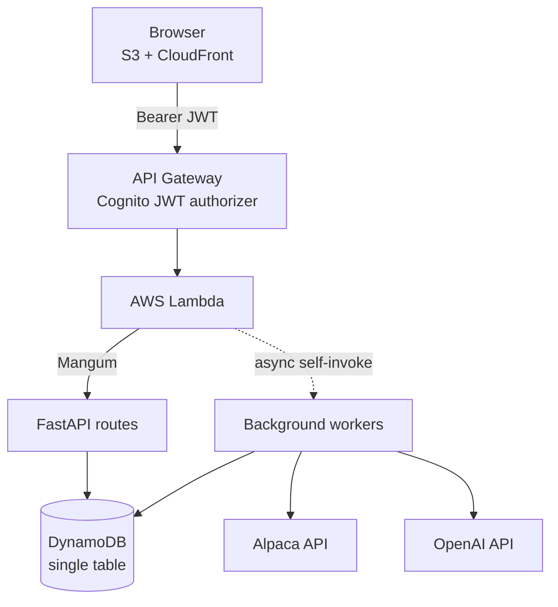

# HELIOS

**A multi-tenant AI agent for cash-secured put trading.**

HELIOS scans an approved universe of ~55 tickers for cash-secured put (CSP) opportunities, enforces hard risk limits in code, asks a language model to review only the candidates that survive those limits, and places paper trades against each user's own brokerage account. It then observes those positions over time and finalizes outcomes from broker evidence, feeding what actually happened back into future recommendations.

The central design principle:

> **The language model never has authority.** Deterministic code decides what is *permissible*; the model only chooses among options that already passed every hard filter.

---

## Live application

**[desaoanznv4ue.cloudfront.net](https://desaoanznv4ue.cloudfront.net)**

Sign in with Google to explore the interface. Running a scan or placing a paper trade additionally requires connecting your own Alpaca paper-trading keys from the profile page — HELIOS never trades against an account you do not own.

---

## Architecture



A single Lambda handles both interactive traffic and background work. Every invocation is inspected for a `worker_action` field at the top of `lambda_handler.py`: invocations without one are ordinary HTTP requests and pass through to FastAPI, while the rest are dispatched directly to a background job.

| `worker_action` | Background job |
| --- | --- |
| `recommendation_scan` | Full CSP scan and AI review |
| `market_take` | Portfolio-aware market commentary |
| `scheduled_outcome_dispatch` | Scheduled entry point; fans out one invocation per user |
| `outcome_observation` | One user's position snapshot and outcome finalization |

---

## How a scan works

1. The browser calls `POST /api/recommendations/jobs`, which writes a job record and returns a job id immediately.
2. The Lambda invokes itself asynchronously and runs the scan outside the API Gateway request path.
3. The worker pulls option chains for the approved universe, applies every hard filter, and scores what remains.
4. Surviving candidates plus market, portfolio, and memory context go to the model for a structured review.
5. The result is persisted, and the browser polls `GET /api/recommendations/jobs/{id}` until it completes.

---

## Engineering decisions

### Long work escapes the request timeout

API Gateway caps requests at roughly 30 seconds. A full scan walks dozens of tickers and then makes a reasoning call, which takes minutes. Rather than trimming the work to fit, HELIOS moves it off the request path: the API creates a job, self-invokes the Lambda asynchronously, and the client polls for completion. Because asynchronous invocations are retried on failure, workers are written to be idempotent.

### Duplicate orders are impossible, not merely unlikely

Every order carries a deterministic client order id derived from `SHA-256(user_id | run_id | contract_symbol)`. The same user acting on the same recommendation for the same contract always produces the same id, so the broker itself rejects a duplicate submission. A second layer stores that id in DynamoDB, so a repeated request returns the original decision instead of recording a new one.

Before any order reaches the broker, placement re-fetches the live option quote and re-validates the spread and liquidity, rejects recommendations older than a short freshness window, counts pending orders against the open-position cap, and reconciles the strategy's capital limit against actual broker buying power.

### Tenant isolation is structural

All user data lives in one DynamoDB table under a partition key of `USER#{cognito_sub}`, with sort-key prefixes separating entity types:

```
pk = USER#{sub}
sk = RUN#{ts}#{id} | CANDIDATE#{contract} | DECISION#{ts}#{id}
     ORDER#{ts}#{id} | POSITION#ORDER#{id} | OUTCOME#{ts}#{id}
     OUTCOME_SNAPSHOT#{date}#{contract}
```

Every read and write builds its key through a single helper that raises if the user id is missing. Cross-tenant access is not prevented by a check that could be forgotten; it is impossible to express, because no key can be constructed without a user id. A job id belonging to another account behaves exactly like a job that does not exist.

Timestamps embedded in sort keys provide chronological ordering for free, and prefix queries retrieve one entity type without scanning the table.

### Risk rules live in code, not in a prompt

Delta band, days to expiration, implied volatility range, maximum spread, minimum return on cash, capital allocation ceiling, and position count limits are all defined in `backend/config.py` and applied before the model is consulted. The model cannot invent a contract, relax a threshold, or exceed an allocation limit — it only ranks what already passed.

Model responses are requested under a strict JSON schema rather than parsed out of prose. Failures are classified into safe diagnostic codes, and a deterministic rule-based reviewer takes over when the model is unavailable, with the interface stating plainly that the fallback was used.

### Outcomes are measured, never inferred

A position disappearing from the broker is not treated as evidence of anything. An outcome is finalized only from a filled closing order or an explicit broker lifecycle activity — assignment, expiration, or cash settlement. Without that evidence, the trade stays unresolved rather than being guessed.

Outcomes are also not reduced to success or failure. When a put is assigned, HELIOS records the premium retained *and* marks the underlying result as still pending, because the shares now held have their own unresolved economics. Repeated patterns require a minimum number of distinct contracts before they count as a pattern, so multiple daily snapshots of one position cannot inflate a sample.

### Prompts stay bounded

Historical context is compacted before it reaches the model: field allowlists, text truncation, and item caps keep old market snapshots and prior reasoning from recursively bloating new prompts.

---

## Tech stack

| Layer | Technology |
| --- | --- |
| API | Python, FastAPI, Mangum |
| Compute | AWS Lambda |
| Data | Amazon DynamoDB (single-table design) |
| Auth | Amazon Cognito with Google identity, PKCE, API Gateway JWT authorizer |
| Brokerage | Alpaca (paper trading) |
| Reasoning | OpenAI Responses API with strict structured output |
| Frontend | Vanilla HTML, CSS, and JavaScript on S3 and CloudFront |

No frontend framework and no build step: the interface is plain ES modules and CSS, served as static files.

---

## Project layout

```
backend/
  api/          FastAPI application, routes, request schemas, shared orchestration
  broker/       Alpaca clients, order submission, quote refresh, lifecycle activities
  strategy/     Option math, candidate filtering, AI review, scan jobs
  market/       Trends, news retrieval and scoring, market commentary, prompt compaction
  memory/       DynamoDB access, recommendations, trades, observations, outcomes, learning
  users/        Profiles, authentication, per-user broker credentials
frontend/
  js/           State, API access, renderers, page loaders, auth, profile
  css/          Shared theme plus per-page styles
tests/          Unit tests with mocked broker and AWS clients
```

---

## Tests

```bash
python -m unittest discover -s tests
```

Thirty unit tests cover order safety, outcome finalization, scheduled observation dispatch, prompt compaction, model error handling, and cross-user data isolation. Broker and AWS clients are mocked, so no network access or credentials are required.

---

## Status and limitations

HELIOS is a working prototype, deliberately scoped:

- **Paper trading only.** Orders are submitted to Alpaca's paper environment. There is no live-money path.
- **Alpaca is the only supported brokerage.** The profile model anticipates others, but only Alpaca is wired to trading.
- **Scanning is sequential.** Tickers are fetched one at a time; parallelizing the option-chain requests is the clearest performance win available.
- **One Lambda serves both the API and every background worker.** Appropriate at this scale, but workloads would be split under real traffic.
- **Tests are unit-level.** Broker and AWS interactions are mocked; there is no integration suite against a live brokerage.

Nothing here is investment advice. It is an engineering project built around a trading strategy, not a recommendation to trade one.

---

## Usage and rights

Copyright © 2026 Nikhil Bhargava. All rights reserved.

This repository is published so that its design and implementation can be read and evaluated. It is **not** open source and is released under no license, meaning no permission is granted to copy, modify, redistribute, or build derivative work from it. To use or discuss the project beyond reading it, please get in touch.
