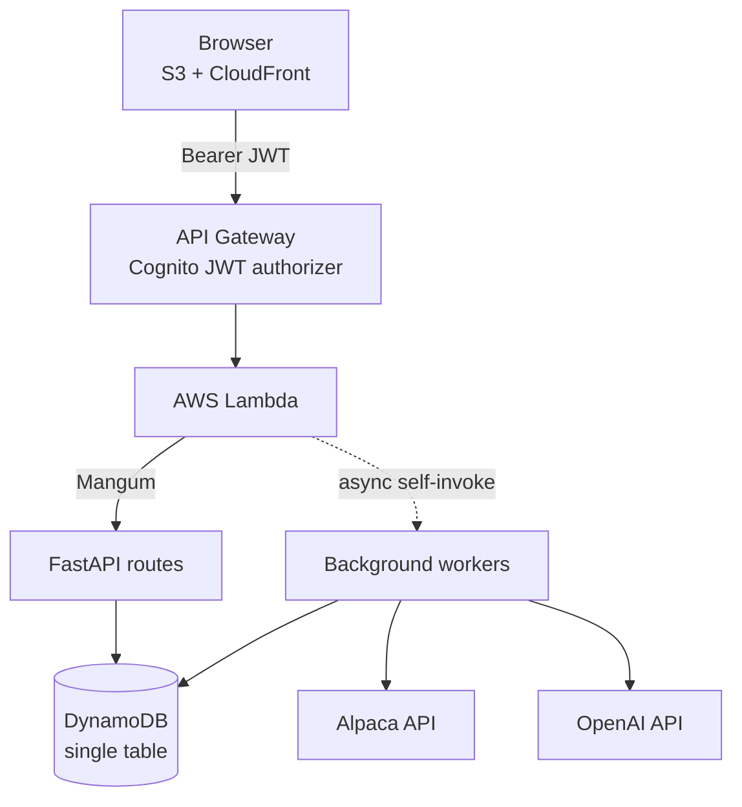

# HELIOS

**An AI trading agent for cash-secured puts, built for multiple users.**

A cash-secured put is a trade where the seller agrees to buy a stock at a set price, collects a premium up front, and holds enough cash to cover the purchase if it happens. HELIOS looks through about 55 approved stocks for these trades, checks each one against strict risk rules written in code, and asks an AI model to review only the ones that pass. Approved trades are placed on the user's own Alpaca paper-trading account.

HELIOS refreshes learning whenever the user starts a CSP scan or explicitly requests a learning refresh. It records how each position is doing and, once a trade actually closes, saves what really happened so future recommendations have real history to work from. Automatic scheduled monitoring is intentionally deferred during the private prototype.

The idea behind the whole design:

> **The AI never gets the final say.** Deterministic code decides which trades are allowed. The model only picks from options that already passed every safety check.

---

## Live application

**[desaoanznv4ue.cloudfront.net](https://desaoanznv4ue.cloudfront.net)**

Signing in with Google gives access to the interface. Running a scan or placing a trade also requires connecting an Alpaca paper-trading account from the profile page — HELIOS never trades on an account the user does not own.

---

## Architecture



One Lambda function handles two kinds of work: normal web requests, and slower jobs that run in the background. It tells them apart by checking for a `worker_action` field at the top of `lambda_handler.py`. If there isn't one, the event is a web request and goes to FastAPI. If there is one, it's a background job:

| `worker_action` | What it does |
| --- | --- |
| `recommendation_scan` | Runs a full scan and AI review |
| `market_take` | Writes market commentary based on current holdings |
| `outcome_observation` | Imports CSP history, records positions, closes finished trades, and saves lessons |
| `scheduled_outcome_dispatch` | Optional future daily dispatcher; not required by the current prototype |

---

## How a scan works

1. The browser calls `POST /api/recommendations/jobs`. The server saves a job and sends back a job ID right away.
2. The Lambda function calls itself in the background, so the scan isn't stuck inside that first web request.
3. The background job pulls option data for the approved stocks, drops anything that breaks a risk rule, and ranks what's left.
4. The surviving trades go to the AI along with current market data, open positions, and how similar past trades turned out.
5. The answer gets saved, and the browser checks `GET /api/recommendations/jobs/{id}` every couple of seconds until it's ready.

Before step 3, the same worker refreshes that user's Alpaca order history and completed outcomes. This gives the current scan the newest available memory without paying for a continuously scheduled service. The backend also exposes `POST /api/learning/jobs` and `GET /api/learning/jobs/{id}` for an explicit refresh.

---

## Design decisions

### Getting around the 30-second timeout

API Gateway kills any request that takes longer than about 30 seconds. A full scan pulls option chains for dozens of stocks and then makes an AI call, which takes minutes — nowhere close to fitting.

Instead of cutting the work down to fit, HELIOS moves it off the web request entirely. The API saves a job, hands back an ID, and triggers the Lambda again in the background where no timeout applies. The browser checks back every few seconds. Since AWS retries background jobs that fail, the workers are idempotent: running one twice causes no harm.

### The same order cannot be placed twice

Every order gets a deterministic ID built by hashing together the user ID, the recommendation it came from, and the exact contract. The same user acting on the same recommendation always produces the same ID, so a duplicate submission is rejected by Alpaca itself. HELIOS also stores that ID, so a repeated request returns the original order instead of creating a second one.

Before anything reaches the broker, the order passes a few more checks. It re-pulls the current option quote to confirm the price and spread haven't moved, refuses recommendations older than a short window, counts pending orders toward the position limit, and compares the strategy's cash limit against what Alpaca reports as actually available.

### Users cannot see each other's data

Everything lives in one DynamoDB table, and every row is stored under a key built from the signed-in user's Cognito ID:

```
pk = USER#{sub}
sk = RUN#{ts}#{id} | CANDIDATE#{contract} | DECISION#{ts}#{id}
     ORDER#{ts}#{id} | POSITION#ORDER#{id} | OUTCOME#{ts}#{id}
     OUTCOME_SNAPSHOT#{date}#{contract} | TRADE_FEEDBACK#{order_id}
     OUTCOME_JOB#{id}
```

Every read and write builds that key through a single helper that fails if the user ID is missing. So this isn't protected by a permission check somebody might forget to write — one account's data cannot be requested at all, because the key cannot be built without that account's ID. Passing in a job ID from another account simply looks like a job that doesn't exist.

Putting timestamps in the sort key also means data comes back in date order for free, and the prefixes make it possible to pull just orders, or just decisions, without scanning the whole table.

### The risk rules live in code, not in the AI prompt

Delta range, days until expiration, implied volatility limits, maximum spread, minimum return, how much cash can be tied up, and the cap on open positions are all set in `backend/config.py` and applied before the AI sees anything. The model can't invent a contract, loosen a threshold, or exceed a limit — it only ranks what already made it through.

The AI also has to answer in a fixed JSON format instead of writing free text that code has to pick apart. If the API fails, the error is sorted into a short list of known problems, and a plain rule-based reviewer takes over — with the interface saying clearly that the AI wasn't used.

### Results come from real evidence, not guesses

A position disappearing from Alpaca doesn't establish what happened to it. HELIOS marks a trade finished only with proof: a filled order that closed it, or an official Alpaca record showing it was assigned, expired, or settled. Without that, the trade stays open in the system rather than being labeled with a guess.

It also avoids reducing trades to wins and losses. When a put is assigned, HELIOS records the premium kept and notes that the outcome isn't final, because the account now holds shares whose gain or loss hasn't happened yet. A pattern counts as a pattern only after it shows up across enough separate contracts, so checking the same position every day can't make a single trade look like a trend.

Filled Alpaca sell-to-open puts can be imported even when they predate the current HELIOS recommendation flow. Those trades are labeled as broker-history imports, so the agent can learn from their economics without falsely claiming it recommended them. Completed outcomes receive a structured post-trade review that separates supported evidence from possible causal explanations.

User feedback is stored separately from financial performance. Satisfaction, willingness to repeat the trade, assignment preference, reason tags, and a note can therefore express cases such as “the option moved against me, but I still wanted the shares.” Explicit feedback may guide future recommendations immediately, while inferred performance patterns still require several independent contracts.

### Keeping the AI prompts small

Old market data and past reasoning are trimmed before going into a new prompt: only certain fields are kept, long text is cut down, and lists are capped. Without that, every prompt would carry all the ones before it and keep growing.

---

## Tech stack

| Layer | Technology |
| --- | --- |
| API | Python, FastAPI, Mangum |
| Compute | AWS Lambda |
| Data | Amazon DynamoDB (single-table design) |
| Auth | Amazon Cognito with Google sign-in, PKCE, API Gateway JWT authorizer |
| Brokerage | Alpaca (paper trading) |
| AI | OpenAI Responses API with structured output |
| Frontend | Plain HTML, CSS, and JavaScript on S3 and CloudFront |

No frontend framework and no build step — the interface is plain JavaScript and CSS served as static files.

---

## Project layout

```
backend/
  api/          FastAPI app, routes, request validation, shared logic
  broker/       Alpaca clients, order placement, quote refresh, trade lifecycle
  strategy/     Option math, filtering, AI review, scan jobs
  market/       Price trends, news, market commentary, prompt trimming
  memory/       Database access, recommendations, trades, observations, outcomes, feedback
  users/        Profiles, sign-in, per-user broker credentials
frontend/
  js/           State, API calls, rendering, page loading, auth, profile
  css/          Shared theme plus per-page styles
tests/          Unit tests with the broker and AWS mocked out
```

---

## Tests

```bash
python -m unittest discover -s tests
```

Thirty-nine tests cover order safety, history import, outcome review, user feedback, closing out trades, background jobs, prompt trimming, AI error handling, and keeping user data separate. The broker and AWS are mocked, so the tests need no network access or credentials.

---

## Status and limitations

HELIOS is a working prototype, and it's scoped on purpose:

- **Paper trading only.** Orders go to Alpaca's paper environment. There's no path to real money.
- **Alpaca only.** The profile setup is built to support other brokers later, but only Alpaca is connected to trading right now.
- **Scanning is one stock at a time.** Fetching option chains in parallel is the most obvious speed improvement available.
- **One Lambda does everything** — both the API and every background job. That's fine at this size, but real traffic would call for splitting them up.
- **Tests are unit tests.** The broker and AWS are mocked; there's no test suite running against a live brokerage.

None of this is investment advice. It's an engineering project built around a trading strategy, not a suggestion to trade one.

---

## Usage and rights

Copyright © 2026 Nikhil Bhargava. All rights reserved.

This repository is public so the design and code can be read and evaluated. It is **not** open source and has no license, which means there is no permission to copy, modify, redistribute, or build on it. Inquiries about anything beyond reading it are welcome by direct contact.
